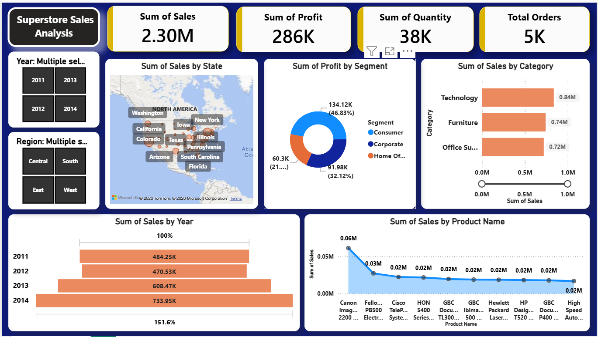

# 📊 Superstore Sales Analytics Dashboard

A complete **Data Analytics Portfolio Project** built using **MySQL, SQL, and Power BI** to analyze retail sales data and generate business insights through interactive dashboards.

---



## 📌 Project Overview

This project focuses on analyzing a retail sales dataset to understand sales performance, customer behavior, product performance, and regional profitability.

The project includes:

- Data Import into MySQL
- SQL Data Analysis
- Data Cleaning & Transformation using Power Query
- Interactive Power BI Dashboard
- Business Insights

---

## 🛠️ Tools & Technologies

- MySQL
- SQL
- Power BI
- Power Query
- DAX
- Microsoft Excel

---

## 📂 Project Structure

```
Superstore-Sales-Analytics/
│
├── Dataset/
│   └── Superstore.csv
│
├── SQL/
│   ├── Create_Table.sql
│   └── Analysis_Queries.sql
│
├── Dashboard/
│   ├── Superstore_Sales_Dashboard.pbix
│   └── Superstore_Sales_Dashboard.pdf
│
├── Images/
│   ├── Dashboard.png
│   ├── Sales_Overview.png
│   ├── Product_Analysis.png
│   └── Customer_Analysis.png
│
└── README.md
```

---

# 📈 Dashboard Features

### Executive Dashboard

- Total Sales
- Total Profit
- Total Orders
- Total Quantity
- Monthly Sales Trend
- Sales by Category
- Profit by Segment
- Interactive Filters

---

### Product Analysis

- Top 10 Products by Sales
- Sales by Category
- Sales by Sub-Category
- Product Performance Analysis

---

### Regional Analysis

- Top States by Sales
- Region Wise Sales
- Region Wise Profit

---

### Customer Analysis

- Customer Segment Analysis
- Top Customers
- Shipping Mode Analysis

---

# 📊 SQL Analysis Performed

The following SQL queries were used for business analysis:

- Total Sales
- Total Profit
- Total Orders
- Total Customers
- Total Products
- Category-wise Sales
- Category-wise Profit
- Region-wise Sales
- Region-wise Profit
- Top 10 Products
- Top 10 Customers
- Top 10 States
- Average Order Value
- Loss Making States
- Shipping Mode Analysis

---

# 📊 Power BI Features

- Data Cleaning using Power Query
- Data Type Transformation
- DAX Measures
- KPI Cards
- Interactive Charts
- Slicers
- Professional Dashboard Design

---

# 📷 Dashboard Preview

## Sales Overview

> Add screenshot here


---

## Product Analysis

> Add screenshot here


---

## Customer Analysis

> Add screenshot here


---

# 💡 Business Insights

- Technology category generated the highest sales.
- High-performing products contribute significantly to overall revenue.
- Sales vary across different regions and states.
- Monthly sales trends help identify seasonal demand.
- Customer segments show different purchasing behaviors.
- Dashboard enables interactive business decision-making.

---

# 🚀 How to Run

### Step 1

Clone the repository.

```bash
git clone https://github.com/yourusername/Superstore-Sales-Analytics.git
```

### Step 2

Import the dataset into MySQL.

### Step 3

Execute:

- Create_Table.sql
- Analysis_Queries.sql

### Step 4

Open

```
Superstore_Sales_Dashboard.pbix
```

using Power BI Desktop.

---

# 🎯 Learning Outcomes

Through this project, I improved my skills in:

- SQL Query Writing
- Data Cleaning
- Data Transformation
- Business Analysis
- Dashboard Design
- Data Visualization
- DAX
- Power BI

---

# 👨‍💻 Author

**Manohar Sonawane**

Aspiring Data Analyst | SQL | Power BI | Python | Excel | Machine Learning

LinkedIn: *(Add your LinkedIn profile link)*

GitHub: *(Add your GitHub profile link)*

---

## ⭐ If you found this project useful, consider giving it a Star!
